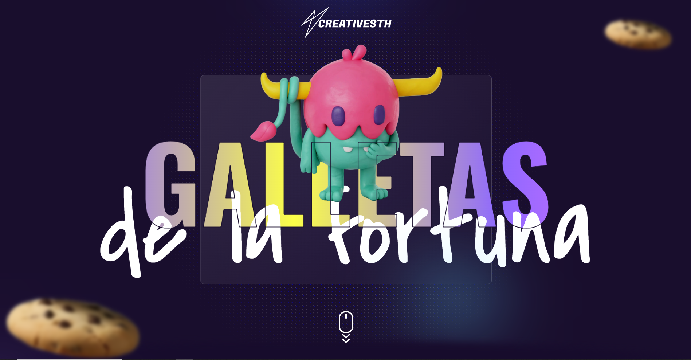

<!-- PROJECT LOGO -->

  

  <h3 align="center">Portfolio App | FORTUNE COCKIES</h3>
  

    ¡Bienvenido a la aplicación Fortune Cookie! 🍪✨
   
Esta aplicación te ofrece una experiencia divertida y única al estilo de las galletas de la fortuna. Con un simple clic, recibirás un mensaje inspirador, un consejo o una predicción que te hará reflexionar.
 

Desarrollada con React, la app cuenta con una interfaz intuitiva y atractiva, permitiéndote disfrutar de tus "galletas" de manera fácil y rápida. Ideal para compartir con amigos o para esos momentos en los que necesitas un poco de inspiración.

¡Prueba tu suerte y descubre qué te depara el destino!
     
    <a href="https://best-pokedex.netlify.app/"><strong>Demo »</strong></a>
     
  

  

# Versión App
- **Versión:** 1.0
- **Fecha (UTC):** 2025-02-08 22:45:57

# Tecnologías

1.  **React**
4.  **JavaScript**
5.  **Css**
